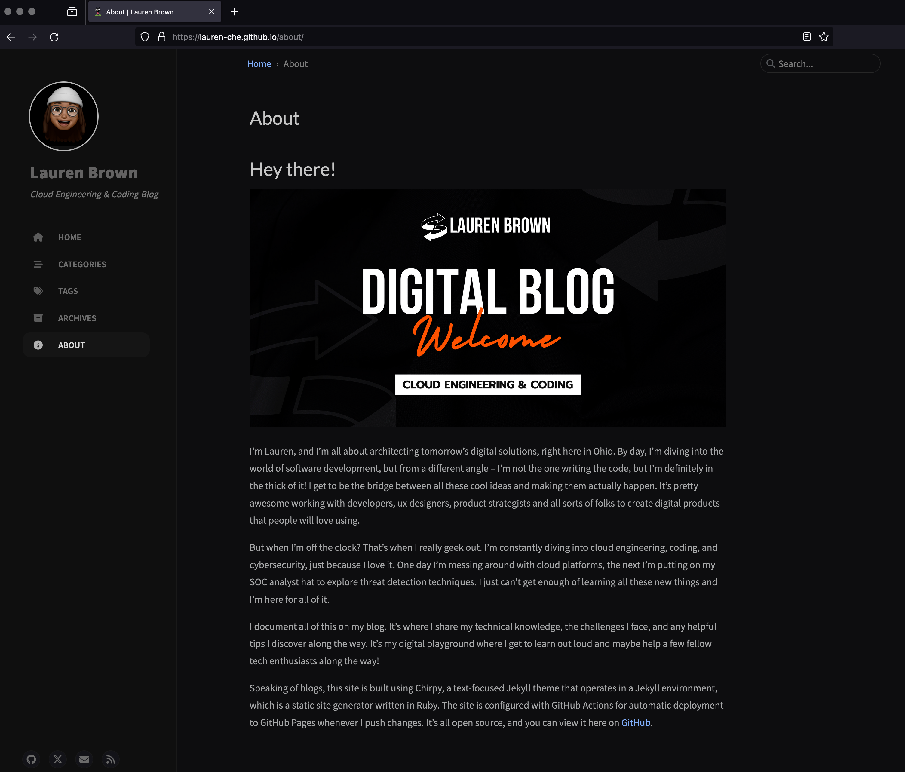

<a id="readme-top"></a>


<!-- PROJECT LOGO -->
<br />
<div align="center">

  <h3 align="center">My Blog Website</h3>

  <p align="center">
    I built this blog using Chirpy, a Jekyll theme known for its simplicity and readability. Jekyll is a powerful static site generator written in Ruby, perfect for creating static websites and blogs from plain text. I chose this technology because I wanted to spend less time building a custom website, but still wanted to host my own site and try a new framework and site generator.
    <br />
    <br />
    <a href="https://github.com/othneildrew/Best-README-Template" style="color: #ff6100;">View Live Blog</a>

  </p>
</div>


<!-- TABLE OF CONTENTS -->
<details>
  <summary>Table of Contents</summary>
  <ol>
    <li><a href="#about-the-project">About The Blog Project</a><li/>
    <li><a href="#built-with">Built With</a></li>
    <li><a href="#prerequisites">Prerequisites</a></li>
    <li><a href="#installation">Installation</a></li>
    <li><a href="#license">License</a></li>
    <li><a href="#contact">Contact</a></li>
    <li><a href="#acknowledgments">Acknowledgments</a></li>
  </ol>
</details>


<!-- ABOUT THE PROJECT -->
## About The Blog Project

<div style="text-align: center;">
  <a href="https://lauren-che.github.io">
    
  </a>
</div>
<br/>


I built this blog website using Chirpy, a Jekyll theme that's known for its simplicity and readability. Jekyll is a powerful static site generator written in Ruby, making it perfect for creating static websites and blogs from plain text.

Features:
* Clean & Minimalist Design 
* Responsive Layout
* Built - In Search
* Dark / Light Theme Mode
* Pinned Posts on Home Page
* Hierarchical Categories
* Trending Tags
* Table of Contents
* Last Modified Date

To make deployment smoother, I set up the site with `GitHub Actions`. This configuration enables automatic deployment to `GitHub Pages` whenever I push changes to the repository. GitHub Actions is a powerful automation tool that simplifies CI/CD workflows, allowing for continuous integration and continuous delivery. This means that any updates or new content are quickly and efficiently reflected on the live site without manual intervention.

<p align="right">(<a href="#readme-top" style="color: #ff6100;">back to top</a>)</p>


### Built With

Below are the major frameworks/libraries and tools I used to develop my blog website. Jekyll and Chirpy are listed in the acknowledgements section. 

[](https://skillicons.dev)


<p align="right">(<a href="#readme-top" style="color: #ff6100;">back to top</a>)</p>


<!-- GETTING STARTED -->
### Prerequisites

* GitHub
* Ruby
* RubyGems
* Jekyll
  

## Installation

Below are the steps I took to get started with developing the blog in my local environment using the Terminal and Visual Studio Code.

1. **Install Ruby**
    Ruby version 2.5.0 or higher, including all development headers. I use macOS as my main operating system when programming so Homebrew was the package manager I used: 
    ```sh
    brew install ruby
    ```

    If Ruby is installed, check Ruby version using:
    ```sh
    ruby -v 
    ```

2. **Install Jekyll and Bundler**

    Proceed to install Jekyll and Bundler:

    ```bash
    gem install jekyll bundler
    ```
3. **Download or update RubyGems if necessary**

    RubyGems is a package management framework for Ruby. Should there be a new release of RubyGems available, update to the latest version:

    ```bash
    gem update --system
    ```
4. **Verify Jekyll Installation**

    Ensure Jekyll is correctly installed by checking its version:

    ```bash
    jekyll -v
    ```
5. **Set Up the Chirpy theme with the Chirpy Starter template**

    I chose to create a new site with the Chirpy theme using the Chirpy Starter because it's incredibly simple and easy to maintain. This method is optimal for its simplicity and ease of maintenance, making it perfect for cloud engineers and non-programmers who want to host their site and focus on their content rather than developing a custom website.

    *a) Use the Chirpy Starter Template*

    - I visited the [Chirpy Starter Repository](https://github.com/cotes2020/chirpy-starter) on GitHub.
    - Clicked on the `Use this template` button at the repository page.
    - I named the new repository `USERNAME.github.io`, where `USERNAME` was my GitHub username. This naming is crucial for GitHub Pages to automatically host the site.
    - Ensured the repository was set to `public`. GitHub Pages requires the repository to be public to serve the website unless you are on a GitHub plan that supports private repositories for GitHub Pages.
    - Clicked `Create repository from template` to initiate the new repository setup.

> My blog site is available at [https://lauren-che.github.io](https://lauren-che.github.io) for now instead of a custom domain. 


6. **Clone New Repository to Local Environment**

- Obtained the SSH link from the new GitHub repository.
- Opened a new Visual Studio Code window and selected `Clone Git Repository`.
- Entered the SSH link. This will be in the format `https://github.com/USERNAME/USERNAME.github.io.git`.
- After entering the URL, selected `Clone from URL:`.
- A dialog box will appear prompting you to select a workspace folder for the cloned repository. I chose my desired location and clicked `Select as Repository Destination` to finalize the cloning process.

7. **Install Jekyll and other Dependencies**
    Back in Visual Studio Code I opened a new terminal and ran the below code to install the dependencies.
    ```sh
    bundle install
    ```


<p align="right">(<a href="#readme-top" style="color: #ff6100;">back to top</a>)</p>


<!-- LICENSE -->
## License

Distributed under the MIT License. See `LICENSE.txt` for more information.

<p align="right">(<a href="#readme-top" style="color: #ff6100;">back to top</a>)</p>


<!-- CONTACT -->
## Contact

Lauren Brown - [github.com/lauren-che](https://github.com/lauren-che)

Live Blog Link: [https://lauren-che.github.io/](https://lauren-che.github.io/)

<p align="right">(<a href="#readme-top" style="color: #ff6100;">back to top</a>)</p>


<!-- ACKNOWLEDGMENTS -->
## Acknowledgments

List of resources I used and found helpful and would like to give credit to.

* [Ruby Download Documentation](https://www.ruby-lang.org/en/downloads/) 
* [RubyGems Download Documentation](https://rubygems.org/pages/download)
* [Jekyll Installation Documentation](https://jekyllrb.com/docs/installation/)
* [Chirpy Jekyll Theme GitHub Repo](https://github.com/cotes2020/jekyll-theme-chirpy)
* [Chirpy Getting Started Documentation](https://chirpy.cotes.page/posts/getting-started/)

<p align="right">(<a href="#readme-top" style="color: #ff6100;">back to top</a>)</p>

